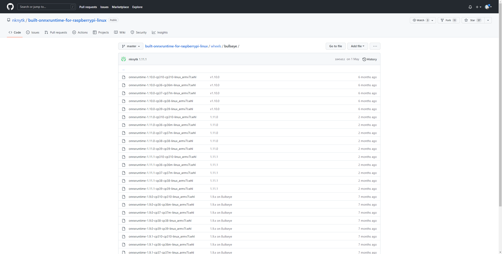

# 0 直接使用配置好环境的 Docker 镜像

+ `python:3.7`
+ `onnxruntime==1.11.1`
+ `opencv-python==4.6.0.66`
+ `numpy==1.21.6`

拉取镜像：

```bash
docker pull ielym/raspberrypi:py37-onnxruntime-1.11.1-cv2-4.6.0.66
```


# 1 环境

该示例在 `Docker` `python:3.7`  的环境下进行测试：

```bash
docker pull python:3.7
```


# 2 树莓派信息

## 2.1 系统架构

```bash
uname -a
```

**需要注意，树莓派一般是 `arm7l` 架构，相关的维护早就停止了，无法直接 `pip install` （这里是个大坑，无论是否在镜像中，以及是否使用conda都不行） 。因此需要重新编译 `onnxruntime` 和 `opencv-python` ，具体方法后续章节介绍。**

## 2.2 系统位数

```bash
getconf LONG_BIT
```

## 2.3 Debian 版本编号

```bash
cat /etc/debian_version
```


# 3 安装 onnxruntime

由于需要重新编译，目前 `Github` 上有编译好的轮子：`https://github.com/nknytk/built-onnxruntime-for-raspberrypi-linux`

+ 按照自己树莓派的 `Debian` 版本编号，选择对应的版本：

  

+ 在对应版本中的 `whl` 中，选择合适的 `onnxruntime` 版本和 `python` 版本对应的 `whl`：

  

之后，直接 `pip install xxx.whl ` 即可。


# 4 安装 opencv-python

+ 打开 `https://www.piwheels.org/simple/opencv-python/` ，按照系统架构 (`arm7l`) 选择对应的 `opencv-python` 的 `whl`
+ `pip install xxx.whl` 即可

之后，安装依赖库:

```bash
sudo apt-get install libatlas-base-dev
sudo apt-get install libjasper-dev
sudo apt-get install libqtgui4
sudo apt-get install libqt4-test
```

运行时发现，有多个动态链接库的版本不匹配：

+ 下载较新的版本的 `cv2`
+ 修改对应动态链接库的名字。

