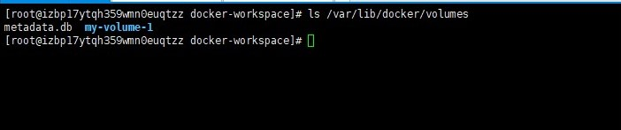
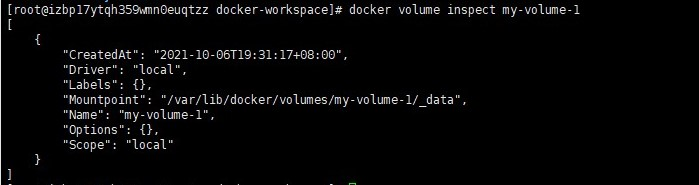
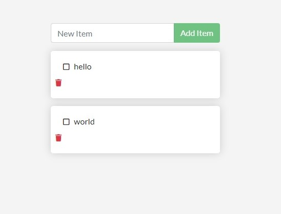
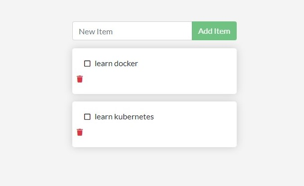

# Docker Volume

We now need to consider two cases about persist docker data:

+ **In the first case, we want to build a web application which may produce some data in a single container, and we want to save them to a database. **But all changes will lost once we removed the container, and the changes also won't be saved to the corresponding docker image. So, how can we persist the data after executing ```docker rm <container-id>```? 
+ **In the second case, we want to build a web application using two containers, one for Django to deploy our main complex projects, and another for Flask to deploy some Deep Learning demos. There are some common user data that we need to share between two containers, how can we share data and how to persist them?**

There are mainly two ways to persist data:
1. **Bind Mount**

2. **Volume**

But let's do some simple experiments before we dive into **Docker data persistence**.

## Simple Experiments

In this section, all experiments depend on docker image ```ubuntu:latest```, so you need to pull it firstly:

```sh
docker pull ubuntu:latest
```

### 1. Remake an image through a changed container

We have got to know that, once we removed a container, all changes we made will lost. So, if we want to save our modifications and data when we removed the running container, the easiest way is to commit the container to a docker image. 

+ Make a container using image ```ubuntu:latest```

  ```sh
  docker run --name u0 -it ubuntu:latest bash
  ```
  
+ Then you will be in the container, and change the directory to  ```/home```:
  ```sh
  cd /home
  ```
  
+ Make a new file ```test1.txt```, and add a line into it:
  ```sh
  touch test1.txt
  echo "first line create by u0" >> test1.txt
  ```
  
+ Open a new terminal an make another container:
  ```sh
  docker run --name u1 -it ubuntu:latest bash
  ```
  
+ Check if the file ```test1.txt``` and the context ```first line create by u0``` are exist in the new container ```u1```
  ```sh
  cat /home/test1.txt
  ```
  Unfortunately, you will get a error message ```cat: /home/test1.txt: No such file or directory```
  
+ Try to commit a new image using container ```u0```:
  ```sh
  # Open a new terminal
  docker commit u0 ubuntu:test1
  ```
  
+ Then we remove ```u0 u1```, and  make a new container ```u2``` by the new image ```ubuntu:test1```
  ```sh
  docker rm -f u0 u1
  docker run --name u2 -it ubuntu:test1 bash
  ```
  
  ```-f``` means remove them by force.
  
+ And check if the ```test1.txt``` and its context exist in container ```u2```:
  
  ```sh
  cat /home/test1.txt
  ```
  You will see ```first line create by u0```, that means we successful persist the change in ```u0``` by committing a new image.
  
  The first experiment have done already, and you can remove all containers and images that made above, except ```ubuntu:latest```. 
### 2. Mount a directory and modify a file

We have a text file in our host, how can we move the file to a container? There are two ways : ```docker cp``` or ```mount```. So, before this experiment, let's create a ```text``` file firstly:

```sh
touch test2.txt
echo "first line create by host" >> test2.txt
```

#### (1) Using ```docker cp```

+ Make a new container ```u0```:

  ```
  docker run --name u0 -it ubuntu:latest bash
  ```
  
+ Open a new terminal, and copy the ```test2.txt``` in the host to ```/home``` in the container:

  ```sh
  docker cp ./test2.txt u0:/home
  ```
  
+ Then you will find the ```test2.txt``` in the directory ```/home``` of the container. And try to output its context:

  ```
  cat /home/test2.txt
  ```

+ But, if we want to change the context in ```test2.txt```, will the modification be synchronized in the host and the container?

  1. Let's insert a line in the ```test2.txt``` of the host:

     ```
     echo "second line create by host" >> test2.txt
     ```

     Then check if the context in ```test2.txt``` of the container has changed too. 

  2. Let's insert a line in the ```test2.txt``` of the container:
  
     ```
     echo "third line create by container u0" >> test2.txt
     ```
  
     Then check if the context in ```test2.txt``` of the host has changed too. 
  
  **Both the two examples can not change the other's file context!** 
  
  You can now remove all containers and txt files created above.

#### (2) using ```mount```

+ Make a ```txt``` file ```test3.txt``` :

  ```sh
  touch test3.txt
  echo "first line create by host" >> test3.txt
  ```

+ Make a new container ```u0``` and amount the current directory of host to ```/home``` of container ```u0```:

  ```
  docker run --name u0 -it -v $(pwd):/home ubuntu:latest bash
  ```

+ Now we are in the docker container, and let's see what is in the ```/home``` folder of container.

  ```sh
  ls /home
  ```

  That's amazing! The home folder in the container has all files and sub-directories the same as your host directory.

+ Let's see if the context in ```/home/test3.txt``` of the container is also the same as the host that we edited just now.

  ```sh
  cat /hoem/test3.txt
  ```

  It's also the same.

+ Now, let's modify the ```test3.txt``` in host, or in container. And to find out if it will change the other's.

  1. Let's insert a line in the ```test3.txt``` of the host:

  ```
  echo "second line create by host" >> test3.txt
  ```

  Then check if the context in ```test3.txt``` of the container has changed too. 

  2. Let's insert a line in the ```test3.txt``` of the container:

  ```
  echo "third line create by container u0" >> test3.txt
  ```

  Then check if the context in ```test3.txt``` of the host has changed too. 

**And It affects the other! That means, the file modifications are synchronized between the host and the container** 

### 3. Two containers mount a same directory

The third experiment is to make two containers ```u1``` and ```u2```, respectively. And they mount a same directory,  then to find out what will happen when we modify the text file in host, in container ```u1``` and container ```u2```.

+ Make a text file in the host.

  ```sh
  touch test4.txt
  echo "first line create by host" >> test4.txt
  ```
+ Make two containers ```u1``` and ```u2``` in two terminals.
  ```sh
  docker run --name u1 -it -v $(pwd):/home ubuntu:latest bash
  ```
  ```sh
  docker run --name u2 -it -v $(pwd):/home ubuntu:latest bash
  ```

+ Out put the context of ```test4.txt``` in host, ```u1``` and ```u2```, respectively.

  ```sh
  # In physical machine
  cat ./test4.txt
  
  # In containers
  cat /home/test4.txt
  ```
+ Insert a new line in host, and then check the context in host, ```u1``` and ```u2```.
  ```sh
  echo "second line create by host" >> test4.txt
  ```
+ Insert a new line in ```u1```, and then check the context in host, ```u1``` and ```u2```.
  ```sh
  echo "third line create by host" >> /home/test4.txt
  ```
+ Insert a new line in ```u2```, and then check the context in host, ```u1``` and ```u2```.
  ```sh
  echo "fourth line create by host" >> /home/test4.txt
  ```

## Persist Data

Through the three experiments above, we should declare two import features about docker container:

1. No matter what you did inner a docker container, all changes will lost when the container is removed.
2. It seems that we can only persist data by sharing files or directories between containers and  the physical machine.

To share files between containers and physical machine, there are mainly two methods, **Bind Mount** and **Volumes**. And There are also many other volume driver plugins available to support NFS, SFTP, NetApp, and more!

### 1. Bind Mount

Bind Mount is to map directories to your containers, changes in that directory are also seen on the host machine. 

The three experiments in the past section are all using the Bind Mount method. So we can find that, Bind Mount uses the files or directories which being created and managed by ourselves. 

Also, it's clearly that if we push our container to a docker registry without uploading the directory or files, others can not use the persisted data even though they pull the image.

We use flag  ```-v``` to mount a directory to the docker container.

### 2. Volume

Volume is almost the same as bind mount that we make a file in the host machine and mount it to the container.

#### (1) Create a volume

So, likes mount a file in host machine, we also need to create a volume first, and then we can mount it to the container. 

A volume can be created manually or automatically by docker. There are some ways to create a volume and then to use it:

+ **Create a named volume manually**. 

  ```sh
  docker volume create my-volume-1
  ```

  After the command above, we have create a named volume ```my-volume-1```, but you will not find it in your current directory. So, what happens when after the command? 

  The volume created by docker are managed by docker too, so all volume are in ```/var/lib/docker/volumes```. You can check it:

  ```sh
  ls /var/lib/docker/volumes
  ```

  

  If you want to know more information about a volume, you can execute:

  ```sh
  docker volume inspect my-volume-1
  ```

  

  Then we can use the ```-v``` flag to specify a volume mount :

  ```sh
  docker run --name u0 -it -v my-volume-1:/home ubuntu:latest bash
  ```

  And try to create a new text file in ```/home``` of the container ```u0```

  ```sh
  echo "hello world u1" >> /home/test1.txt
  ```

  Then to check if there are also a ```test1.txt``` in ```/var/lib/docker/volumes/_data```.

  All changes in container and host machine will be synchronized.

+ **Named volume without creating before using**

  If we want to use a named volume by:

  ```sh
  docker run --name u1 -it -v my-volume-2:/home ubuntu:latest bash
  ```

  Unfortunately, we forgot to create it by ```docker volume create my-volume-2 ```. Don't worry, the docker will create the ```my-volume-2``` volume automatically if the volume name not exist in ```/var/lib/docker/volume```.

+ **Anonymous volume**

  So, what will happen when we did not specify a volume name, and mount it to the container? Like:

  ````sh
  docker run --name u2 -it -v /home ubuntu:latest bash
  ````

  It's clearly that the docker can not create a named volume.  Then the docker will create a anonymous volume, also in the ```/var/lib/docker/volume``` :

  

#### (2) Let's persist the "Todo List" web application data

When we start a container and create some "Todo List" like:



This will disappear when we remove the current container and start a new container. So, we are going to use a **named volume**.

+ Create a named volume:

  ```sh
  docker volume create todo-db
  ```

+ Stop and remove the todo app container, as it is still running without using the persistent volume.

  ```sh
  docker rm -f <container-id>
  ```

+ Start a new todo app container, and specify a volume ```todo-db```, then mount the named volume to ```/etc/todos``` in the container.

  ```sh
  docker run -dp 3000:3000 -v todo-db:/etc/todos getting-started:latest
  ```

+ Once the container starts up, open the web browser and add a few items to your todo list.

  

+ Stop and remove the container. And then start a new container:

  ```sh
  docker rm -f <container-id>
  
  docker run -dp 3000:3000 -v todo-db:/etc/todos getting-started:latest
  ```

+ You will find the data are persisted in your host machine.

