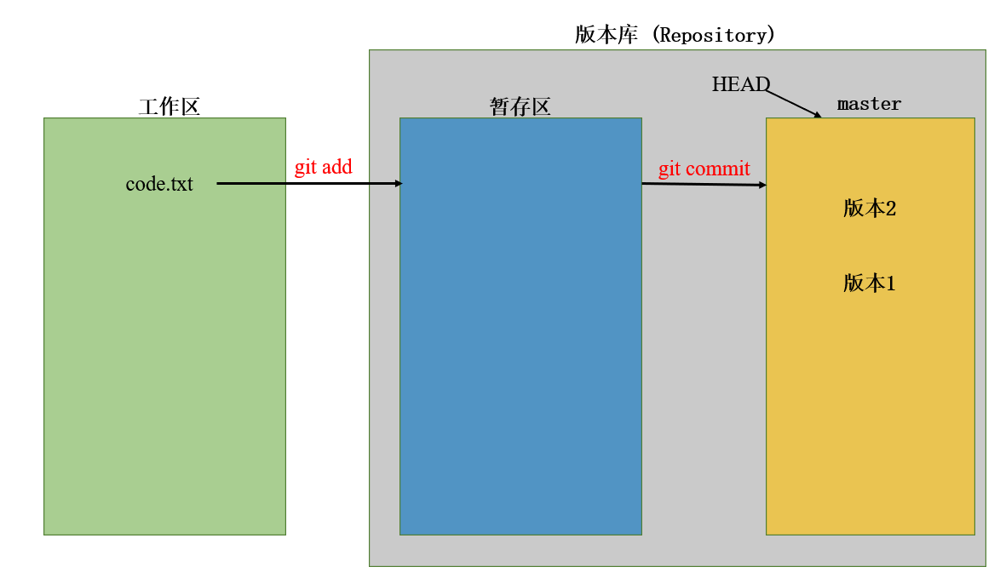

# 工作区，暂存区，git status

## 1.1  工作区 （Working Directory）

工作区即我们代码文件目录，本项目中就是`GitWorkSpace`目录，`.git`所在的目录。

## 1.2 版本库

我们在`git init`创建版本之后，会出现一个隐藏目录`.git`，这个隐藏目录就是版本库。

`.git`目录中有：

```
drwxrwxr-x  8 ymluo ymluo  4096 11月 26 22:24 .
drwxr-xr-x 22 ymluo ymluo 36864 11月 26 22:25 ..
drwxrwxr-x  2 ymluo ymluo  4096 11月 26 22:21 branches
-rw-rw-r--  1 ymluo ymluo     3 11月 26 22:24 COMMIT_EDITMSG
-rw-rw-r--  1 ymluo ymluo    92 11月 26 22:21 config
-rw-rw-r--  1 ymluo ymluo    73 11月 26 22:21 description
-rw-rw-r--  1 ymluo ymluo    23 11月 26 22:21 HEAD
drwxrwxr-x  2 ymluo ymluo  4096 11月 26 22:21 hooks
-rw-rw-r--  1 ymluo ymluo   137 11月 26 22:24 index
drwxrwxr-x  2 ymluo ymluo  4096 11月 26 22:21 info
drwxrwxr-x  3 ymluo ymluo  4096 11月 26 22:24 logs
drwxrwxr-x  7 ymluo ymluo  4096 11月 26 22:24 objects
drwxrwxr-x  4 ymluo ymluo  4096 11月 26 22:21 refs
```

版本库中最重要的区域就是暂存区`stage`或`index`。还有指向`master`的指针`HEAD`。

## 1.3 暂存区 (index / stage)



执行`git commit`之后，会把暂存区的所有内容一次提交到当前分支。而在`git commit`之前，我们可以多次`git add`来从工作区向暂存区进行添加。

## 1. 4 git status

`git status`用来查看在上次提交(`git commit`)之后，是否对工作区的文件又进行了修改。

此时我们在工作区中再新建一个文件`code2.txt`：

```
the code2 first line
```

然后先别急着`git add`，我们再修改一次`code1.txt`，添加一行：

```
this is the third line
```

然后，执行

```
git status
```

输出如下：

```
On branch master
Changes not staged for commit:
  (use "git add <file>..." to update what will be committed)
  (use "git restore <file>..." to discard changes in working directory)
        modified:   code.txt

Untracked files:
  (use "git add <file>..." to include in what will be committed)
        code2.txt

no changes added to commit (use "git add" and/or "git commit -a")
```

输出描述的非常清晰：

1. 在`master`分支

2. 没有被提交的改动：

   ​	修改了 `code.txt`

   ​	(可以使用 `git add <file>...`来更新将被`committed`的内容)

   ​	(可以使用`git restore <file>...`来撤销工作区的修改)

3. 没有被跟踪的文件：

   ​	`code2.txt`

   ​	(可以使用`git add <file>...`来包含将被`committed`的内容)

需要注意的是，虽然我们对`code.txt`进行了修改（添加了一行），并且新建了`code2.txt`，但是除此之外，我们并没有做其他任何的操作。但是，`git`还是帮助我们监控到了所做的修改，并给出了相对应的建议。所以，虽然当前`GitWorkSpace`目录看似是我们自己电脑的目录，但是，他已经作为工作区被当作`git`的一部分了。

新建的文件`code2.txt `虽然被监控到了，但是因为还没有被提交到版本库中，所以`git`还没有办法帮助管理文件的内容。

 此时，我们使用`git add .`来一次性的把所有修改、新建从工作区提交到暂存区中。或者指定需要提交的文件`git add code.txt code2.txt`仅仅把`code.txt code2.txt`的改变提交到暂存区中。

随后，我们再使用`git status`来查看：

```
On branch master
Changes to be committed:
  (use "git restore --staged <file>..." to unstage)
        modified:   code.txt
        new file:   code2.txt
```

然后就可以提交到分支并创建一个版本了:

```
git commit -m "create code2.txt and add the third line in code.txt"
```

使用`git log`查看，就会发现又多了一个版本：

```
commit 039d7a34d6757810488b043953d4c5b585ff4f79 (HEAD -> master)
Author: ielym <ieluoyiming@163.com>
Date:   Fri Nov 26 22:58:55 2021 +0800

    create code2.txt and add the third line in code.txt

commit 836c8a44d764ddb647f2d1b628bb0c1bbbd9c964
Author: ielym <ieluoyiming@163.com>
Date:   Fri Nov 26 21:18:33 2021 +0800

    add a new line in code.txt

commit 9ba4616f3c4486513febad56616046157bba6a77
Author: ielym <ieluoyiming@163.com>
Date:   Fri Nov 26 21:12:20 2021 +0800

    create code.txt file
```

我们再执行一次`git status`:

```
On branch master
nothing to commit, working tree clean
```

就会发现工作区是干净的了。

## 1. 5 扩展

再来理解一次`git commit`只把暂存区的修改提交到分支来创建版本。

1. 在`code.txt`中添加一行：

   ```
   this is the forth line
   ```

   之后添加到暂存区

   ```
   git add .
   ```

2. 然后，再向`code.txt`中添加一行：

   ```
   this is the new line
   ```

   然后这次不`git add`，而是直接`git commit`创建版本：

   ```
   git commit -m "add the forth line to code.txt"
   ```

然后：

1. `git status`来检查一下工作区的修改

   ```
   On branch master
   Changes not staged for commit:
     (use "git add <file>..." to update what will be committed)
     (use "git restore <file>..." to discard changes in working directory)
           modified:   code.txt
   
   no changes added to commit (use "git add" and/or "git commit -a")
   ```

   可以发现，我们做了两次修改，但是只把第一次修改的内容添加到了缓存区，第二次的修改并没有添加到缓存区，因此在`git commmit`之后，工作区中还会提示有修改的内容未被提交。

2. 我们`git log`查看一下当前有哪写版本：

   ```
   commit fe03b43a447c206cbde67f68c00c9d32b35ad947 (HEAD -> master)
   Author: ielym <ieluoyiming@163.com>
   Date:   Fri Nov 26 23:43:59 2021 +0800
   
       add the forth line to code.txt
   
   commit 039d7a34d6757810488b043953d4c5b585ff4f79
   Author: ielym <ieluoyiming@163.com>
   Date:   Fri Nov 26 22:58:55 2021 +0800
   
       create code2.txt and add the third line in code.txt
   
   commit 836c8a44d764ddb647f2d1b628bb0c1bbbd9c964
   Author: ielym <ieluoyiming@163.com>
   Date:   Fri Nov 26 21:18:33 2021 +0800
   
       add a new line in code.txt
   
   commit 9ba4616f3c4486513febad56616046157bba6a77
   Author: ielym <ieluoyiming@163.com>
   Date:   Fri Nov 26 21:12:20 2021 +0800
   
       create code.txt file
   ```

   可以发现，`"add the forth line to code.txt"`的版本已经被成功创建了。

3. 我们回退一次版本

   ```
   git reset --hard HEAD~1
   ```

   检查`code.txt`:

   ```
   this is the first line
   this is the second line
   this is the third line
   ```

   发现只有三行了，没有任何问题。

4. 我们再切换到`"add the forth line to code.txt"`的版本：

   ```
   git reset --hard fe03b43
   ```

   检查`code.txt`:

   ```
   this is the first line
   this is the second line
   this is the third line
   this is the forth line
   ```

   发现，我们`this is the forth line`回来了，但是刚才添加的`this is the new line`并没有回来(因为我们刚才创建版本的时候，并没有在添加完这一行之后把修改提交到暂存区)。

5. 那么，实际开发中，可能我们一时疏忽，忘了`git add`了，之后恰好又切换到了其他版本。当再次切换回来的时候，怎么恢复忘了提交到暂存区中的内容呢？
