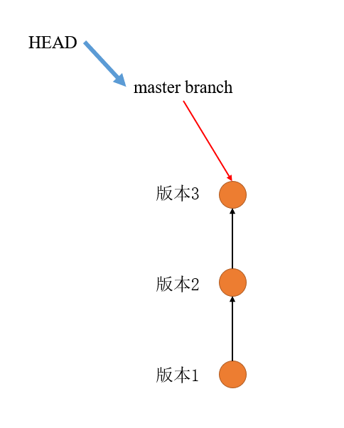

分支是`git`的一个特点，即可以多个人同时进行开发。但是为了保证多人开发之间互不影响，可以给每人创建一条分支。在自己的分支上正常工作，正常提交，但是别人是看不到的。

在初始化`git`时，自动创建了一个`master`分支，我们在之前的所有操作都是在`master`分支上进行的。我们已经在`master`分支中创建了多个版本，`git`会把我们每次提交的版本串成一条时间线，也可以理解为，这条时间线就是一个分支。如下图所示：



`master`分支可以看作一个指针，此时指向了我们的最新版本。而`HEAD`指向的是`master`指针。每次提交的时候，`master`向前移动一步。


当我们创建新的分支时，实际上就是创建了一条新的指针，这个新指针和`master`指针作用相同，即指向版本。在之前的操作中，我们都是通过操作`HEAD`指针来改变指向的不同版本，如果我们此时想在新的分支中操作，则需要把`HEAD`指针拿过来指向我们新的分支。如，我们创建一个叫做`lym`的分支，如下图所示：


之后我们再对`HEAD`指针的操作，就是再`lym`分支上了。如，我们此时创建了一个新的版本：


`lym`分支指针和`HEAD`指针向前移动了一位，但是此时我们所作的修改和`master`已经没有关系了，`master`仍然还是指向了之前的版本。


那么此时某个人已经开发完成了，需要把自己的分支`lym`合并到主分支`master`上，这个过程也仅仅是移动`master`指针的过程：


合并完成后，`lym`分支已经完成任务了，可以删除分支，这个过程也就是删除指针的过程。


## 1 查看分支

查看当前有几个分支，以及现在是在哪个分支里面：

```
git branch
```

```
* master
```

可以看到，现在只有`master`一个分支，前面的`*`号表示我们正在`master`分支中。

## 2 创建并切换(改变HEAD指针指向)到新的分支

```
git checkout -b <branch-name> = git branch <branch-name> + git checkout <branch-name>
```

如，`git checkout -b lym`

再来`git branch`查看分支：

```
* lym
  master
```

我们在新的分支中使用`git log`，发现版本我们都有。

## 3 在新分支中编辑文件

在`code.txt`中添加一行`add one line - lym`，然后`git add`, `git commit`提交。

之后`git log`查看：

```
commit aa603ba18331fb3fdcceea63a10e73cd7da34b77 (HEAD -> lym)
Author: ielym <ieluoyiming@163.com>
Date:   Sat Nov 27 19:12:57 2021 +0800

    lym add a new line

commit de64484d7b5691f4372768deff120c02f8235956 (master)
Author: ielym <ieluoyiming@163.com>
Date:   Sat Nov 27 18:32:35 2021 +0800

    del code2.txt

commit fe03b43a447c206cbde67f68c00c9d32b35ad947
Author: ielym <ieluoyiming@163.com>
Date:   Fri Nov 26 23:43:59 2021 +0800

    add the forth line to code.txt

commit 039d7a34d6757810488b043953d4c5b585ff4f79
Author: ielym <ieluoyiming@163.com>
Date:   Fri Nov 26 22:58:55 2021 +0800

    create code2.txt and add the third line in code.txt

commit 836c8a44d764ddb647f2d1b628bb0c1bbbd9c964
Author: ielym <ieluoyiming@163.com>
Date:   Fri Nov 26 21:18:33 2021 +0800

    add a new line in code.txt

commit 9ba4616f3c4486513febad56616046157bba6a77
Author: ielym <ieluoyiming@163.com>
Date:   Fri Nov 26 21:12:20 2021 +0800

    create code.txt file
```

##  4 切换分支

我们在`lym`分支的工作都已经完成了，此时想要切换回`master`分支：

```
git checkout master
```

```
commit de64484d7b5691f4372768deff120c02f8235956 (HEAD -> master)
Author: ielym <ieluoyiming@163.com>
Date:   Sat Nov 27 18:32:35 2021 +0800

    del code2.txt

commit fe03b43a447c206cbde67f68c00c9d32b35ad947
Author: ielym <ieluoyiming@163.com>
Date:   Fri Nov 26 23:43:59 2021 +0800

    add the forth line to code.txt

commit 039d7a34d6757810488b043953d4c5b585ff4f79
Author: ielym <ieluoyiming@163.com>
Date:   Fri Nov 26 22:58:55 2021 +0800

    create code2.txt and add the third line in code.txt

commit 836c8a44d764ddb647f2d1b628bb0c1bbbd9c964
Author: ielym <ieluoyiming@163.com>
Date:   Fri Nov 26 21:18:33 2021 +0800

    add a new line in code.txt

commit 9ba4616f3c4486513febad56616046157bba6a77
Author: ielym <ieluoyiming@163.com>
Date:   Fri Nov 26 21:12:20 2021 +0800

    create code.txt file
```

但是我们发现，`master`分支上并没有刚才`lym`分支的版本记录。因此需要合并分支。

## 5 合并分支(快速合并)

我们当前在`master`分支上，想要把`lym`分支合并过来：

```
git merge lym
```

```
Updating de64484..aa603ba
Fast-forward
 code.txt | 3 ++-
 1 file changed, 2 insertions(+), 1 deletion(-)
```

```
commit aa603ba18331fb3fdcceea63a10e73cd7da34b77 (HEAD -> master, lym)
Author: ielym <ieluoyiming@163.com>
Date:   Sat Nov 27 19:12:57 2021 +0800

    lym add a new line

commit de64484d7b5691f4372768deff120c02f8235956
Author: ielym <ieluoyiming@163.com>
Date:   Sat Nov 27 18:32:35 2021 +0800

    del code2.txt

commit fe03b43a447c206cbde67f68c00c9d32b35ad947
Author: ielym <ieluoyiming@163.com>
Date:   Fri Nov 26 23:43:59 2021 +0800

    add the forth line to code.txt

commit 039d7a34d6757810488b043953d4c5b585ff4f79
Author: ielym <ieluoyiming@163.com>
Date:   Fri Nov 26 22:58:55 2021 +0800

    create code2.txt and add the third line in code.txt

commit 836c8a44d764ddb647f2d1b628bb0c1bbbd9c964
Author: ielym <ieluoyiming@163.com>
Date:   Fri Nov 26 21:18:33 2021 +0800

    add a new line in code.txt

commit 9ba4616f3c4486513febad56616046157bba6a77
Author: ielym <ieluoyiming@163.com>
Date:   Fri Nov 26 21:12:20 2021 +0800

    create code.txt file
```

上面的合并方式是快速合并，但是在有些情况下是不能够使用快速合并的。

# 6 删除分支

```
git branch -d lym
```

```
> git branch
* master
```

