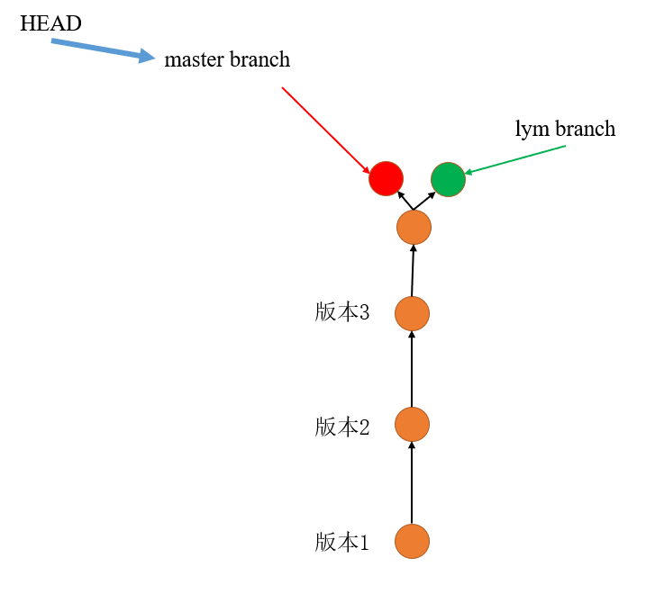

# 1 分支冲突

**在两个分支上都修改了同一个文件，并且都进行了提交，在合并分支时就会造成冲突**

**必须手动的解决，解决之后需要再进行新的提交**

## 分支和master冲突

首先考虑个简单的场景，developer A 使用`lym`分支在`code.txt`中添加了一行`lym's code`，并且提交创建了一个新版本`lym's code`；在这同时，developer B使用`master`分支在`code.txt`中添加了一行`master's code`，并且也提交创建了一个新版本`master's code`。

然后，我们在`master`分支，想要合并`lym`分支，合并之后的`code.txt`会是什么样呢？

首先完成以下上述的场景：

```
git branch lym
git checkout lym
vim code.txt
# lym's code
git add code.txt
git commit -m "lym's code"
```

```
commit 1806f8e8df0c713d81785c6de5eceaa591140b14 (HEAD -> lym)
Author: ielym <ieluoyiming@163.com>
Date:   Sat Nov 27 21:46:36 2021 +0800

    lym's code

commit aa603ba18331fb3fdcceea63a10e73cd7da34b77 (master)
Author: ielym <ieluoyiming@163.com>
Date:   Sat Nov 27 19:12:57 2021 +0800

    lym add a new line

commit de64484d7b5691f4372768deff120c02f8235956
Author: ielym <ieluoyiming@163.com>
Date:   Sat Nov 27 18:32:35 2021 +0800

    del code2.txt

commit fe03b43a447c206cbde67f68c00c9d32b35ad947
Author: ielym <ieluoyiming@163.com>
Date:   Fri Nov 26 23:43:59 2021 +0800

    add the forth line to code.txt

commit 039d7a34d6757810488b043953d4c5b585ff4f79
Author: ielym <ieluoyiming@163.com>
Date:   Fri Nov 26 22:58:55 2021 +0800

    create code2.txt and add the third line in code.txt

commit 836c8a44d764ddb647f2d1b628bb0c1bbbd9c964
Author: ielym <ieluoyiming@163.com>
Date:   Fri Nov 26 21:18:33 2021 +0800

    add a new line in code.txt

commit 9ba4616f3c4486513febad56616046157bba6a77
Author: ielym <ieluoyiming@163.com>
Date:   Fri Nov 26 21:12:20 2021 +0800

    create code.txt file
```

```
git checkout master
vim code.txt
# master's code
git add code.txt
git commit -m "master's code"
```

````
commit c200d2292d3270e8c8c37c16f44b22f20aba95ce (HEAD -> master)
Author: ielym <ieluoyiming@163.com>
Date:   Sat Nov 27 21:47:50 2021 +0800

    master's code

commit aa603ba18331fb3fdcceea63a10e73cd7da34b77
Author: ielym <ieluoyiming@163.com>
Date:   Sat Nov 27 19:12:57 2021 +0800

    lym add a new line

commit de64484d7b5691f4372768deff120c02f8235956
Author: ielym <ieluoyiming@163.com>
Date:   Sat Nov 27 18:32:35 2021 +0800

    del code2.txt

commit fe03b43a447c206cbde67f68c00c9d32b35ad947
Author: ielym <ieluoyiming@163.com>
Date:   Fri Nov 26 23:43:59 2021 +0800

    add the forth line to code.txt

commit 039d7a34d6757810488b043953d4c5b585ff4f79
Author: ielym <ieluoyiming@163.com>
Date:   Fri Nov 26 22:58:55 2021 +0800

    create code2.txt and add the third line in code.txt

commit 836c8a44d764ddb647f2d1b628bb0c1bbbd9c964
Author: ielym <ieluoyiming@163.com>
Date:   Fri Nov 26 21:18:33 2021 +0800

    add a new line in code.txt

commit 9ba4616f3c4486513febad56616046157bba6a77
Author: ielym <ieluoyiming@163.com>
Date:   Fri Nov 26 21:12:20 2021 +0800

    create code.txt file
````

此时分支的关系如图所示：



然后，我们想要`git merge lym`，先别着急。

现在，`lym`分支中`code.txt`的内容为：

```
this is the first line
this is the second line
this is the third line
this is the forth line
add one line - lym
lym's code
```

`master`分支中的内容为：

```
this is the first line
this is the second line
this is the third line
this is the forth line
add one line - lym
master's code
```

两个分支的最后一行不一样，合并之后，是`lym's code`和`master's code`都保留下来了？还是只保留了一个？还是会出错呢？

带着疑问，我们现在执行`git merge lym`:

```
Auto-merging code.txt
CONFLICT (content): Merge conflict in code.txt
Automatic merge failed; fix conflicts and then commit the result.
```

发现提示conflict重提，自动合并失败。

查看`code.txt`:

```
this is the first line
this is the second line
this is the third line
this is the forth line
add one line - lym
<<<<<<< HEAD
master's code
=======
lym's code
>>>>>>> lym
```

我们也可以查看`git status`:

```
On branch master
You have unmerged paths.
  (fix conflicts and run "git commit")
  (use "git merge --abort" to abort the merge)

Unmerged paths:
  (use "git add <file>..." to mark resolution)
        both modified:   code.txt

no changes added to commit (use "git add" and/or "git commit -a")
```

也告诉了我们`both modified: code.txt`

这里的解决方法只能手动的去融合以下，比如，把`code.txt`中的一些提示信息给删掉:

```
this is the first line
this is the second line
this is the third line
this is the forth line
add one line - lym
master's code
lym's code
```

然后再`add, commit`提交一个新版本：

```
git add code.txt
git commit -m "solve conflict issue"
```


