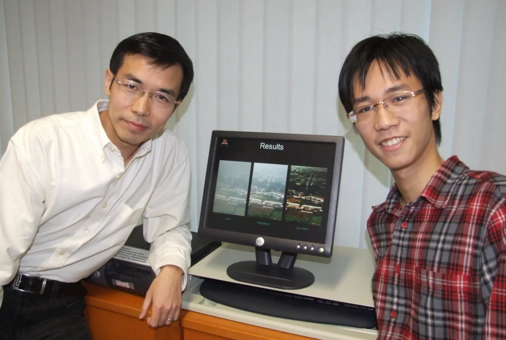
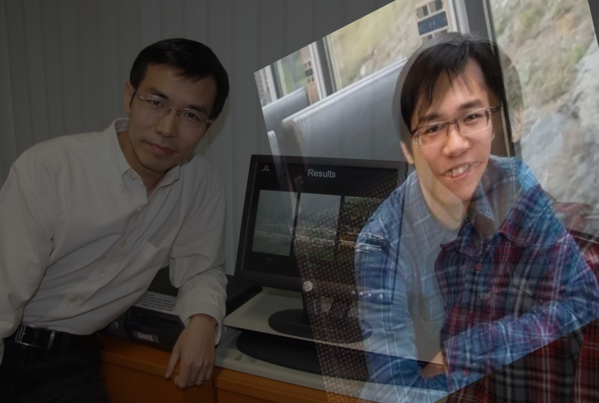

# 0 基本概念

仿射变换是从一个二维坐标系变换到另一个二维坐标系，属于线性变换。

通过原图和目标图像上对应的3对坐标点可以计算出变换矩阵。

仿射变换 (Affine Transformation) 指的是在向量空间中进行一次线性变换（乘以一个矩阵）和一次平移（加上一个向量），从而变换到另一个向量空间的过程。

观察文档 `图像基本变换.md` 中的平移、缩放、旋转和错切。可以发现，不同的变换都可以使用一个 $3 \times 3$ 或 $2 \times 3$ 的变换矩阵，并通过矩阵乘法的方式实现。其中，在 $3 \times 3$ 的矩阵当中，第三行实际上对变换没有任何影响，只是为了保证变换矩阵是方阵，从而可以计算其逆矩阵，方便代码实现。

$2 \times 3$ 的变换矩阵形如：
$$
\begin{bmatrix}
a_{00} & a_{01}& b_{00}  \\
b_{10} & a_{11} & b_{10} \\

\end{bmatrix}

=

\begin{bmatrix}

A & B \\

\end{bmatrix}
$$
对比平移 和 缩放、旋转、错切的变换矩阵的形式可以发现：

+ $B$ 矩阵决定着平移量
+ $A$ 矩阵的主对角线决定缩放
+ $A$ 矩阵的次对角线决定旋转或错切

对于原始图像上的位置 $(x, y)$ ，经过变换矩阵变换的过程可以表示为：
$$
\begin{bmatrix}
a_{00} & a_{01}& b_{00}  \\
b_{10} & a_{11} & b_{10} \\
0 & 0 & 1 \\
\end{bmatrix}

\begin{bmatrix}
x & ... \\
y & ... \\
1 & ...
\end{bmatrix}

= 

\begin{bmatrix}
a_{00}x + a_{01}y + b_{00} \\
a_{10}x + a_{11}y + b_{10} \\
1 \\
\end{bmatrix}
$$

# 1 计算变换矩阵

## 1.1 任务描述

考虑如下场景题：

任务是把第一张图像，经过仿射变换之后，使得两张图像的面部基本重合。如下所示：

## 1.2 问题分析

仿射变换只需要一个 $2 \times 3$ 或 $3 \times 3$ 的变换矩阵即可完成：
$$
\begin{bmatrix}
a_{00} & a_{01}& b_{00}  \\
b_{10} & a_{11} & b_{10} \\
0 & 0 & 1 \\
\end{bmatrix}

\begin{bmatrix}
x_{src} & ... \\
y_{src} & ... \\
1 & ...
\end{bmatrix}

= 

\begin{bmatrix}
a_{00}x_{src} + a_{01}y_{src} + b_{00} \\
a_{10}x_{src} + a_{11}y_{src} + b_{10} \\
1 \\
\end{bmatrix}

=

\begin{bmatrix}
x_{dst} & ... \\
y_{dst} & ... \\
1 & ...
\end{bmatrix}
$$
需要注意的是， 上式中 $x$ 和 $y$ 表示的是图像中像素的位置坐标，是已知量。而变换矩阵中的 $a_{ij}$ 和 $b_{ij}$ 是未知量（6个未知数）。

如果能够计算出 $a_{ij}$ 和 $b_{ij}$ 的值，即可完成仿射变换。

根据上式可列出两个方程：
$$
a_{00}x_{src} + a_{01}y_{src} + b_{00} = x_{dst}
$$
和
$$
a_{10}x_{src} + a_{11}y_{src} + b_{10} = y_{dst}
$$
其中每个方程各包含3个未知数，因此为了分别求解两个方程中的未知数，只需要在原图和目标图像中分别找到3组对应的点即可求解：
$$
\begin{align*}
\begin{split}
\left \{
\begin{array}{ll}
 
a_{00}x_{src}^{1} + a_{01}y_{src}^{1} + b_{00} = x_{dst}^{1}\\
a_{00}x_{src}^{2} + a_{01}y_{src}^{2} + b_{00} = x_{dst}^{2}\\
a_{00}x_{src}^{3} + a_{01}y_{src}^{3} + b_{00} = x_{dst}^{3}
 
\end{array}
\right.
\end{split}
\end{align*}
$$

$$
\begin{align*}
\begin{split}
\left \{
\begin{array}{ll}
 
a_{10}x_{src}^{1} + a_{11}y_{src}^{1} + b_{10} = y_{dst}^{1}\\
a_{10}x_{src}^{2} + a_{11}y_{src}^{2} + b_{10} = y_{dst}^{2}\\
a_{10}x_{src}^{3} + a_{11}y_{src}^{3} + b_{10} = y_{dst}^{3}
 
\end{array}
\right.
\end{split}
\end{align*}
$$

## 1.3 问题求解

我们可以在两张图像上选择脸部对应的3组特征点，如下图所示：

之后，即可通过3个对应坐标点来分别求解两组方程中的3个未知数，求得变换矩阵：
$$
\begin{bmatrix}
1.33109033e+00 & 3.63549467e-01 & 5.38044984e+02  \\
-6.83214961e-01 & 1.60617832e+00 & 1.54728709e+02 \\
0 & 0 & 1 \\
\end{bmatrix}
$$
之后，可以按照 文档 `图像基本变换.md` 中的代码，替换变换矩阵的数值进行仿射变换。

# 2 仿射变换的性质

仿射变换保持了二维图像在变换前后具有 **平直性** 和 **平行性**

平直性：

+ 直线经过仿射变换之后仍然是直线
+ 圆弧经过仿射变换之后仍然是圆弧

平行性：

+ 直线之间的相对位置关系保持不变
+ 平行线经过仿射变换之后仍然平行
+ 直线上点的位置顺序不会发生变化
+ **向量间的夹角经过仿射变换之后可能会发生变化**
