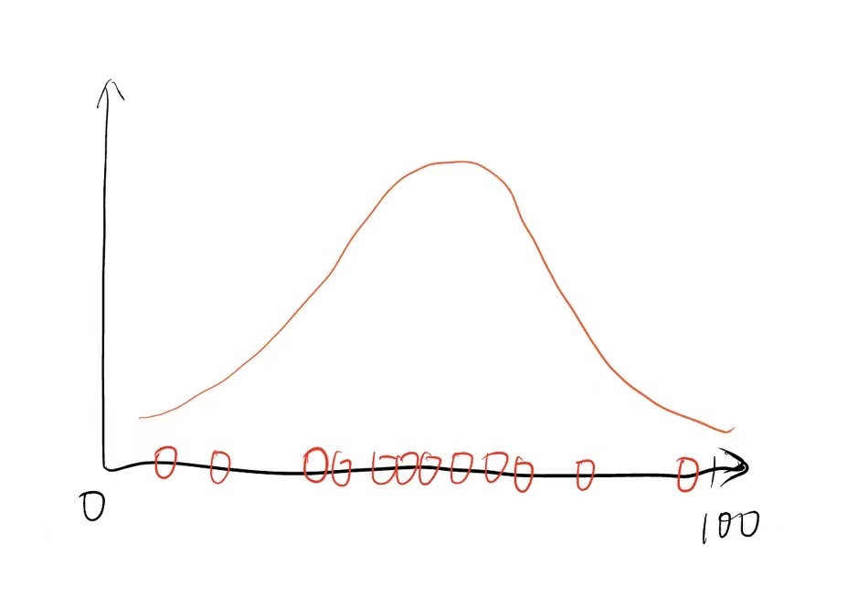
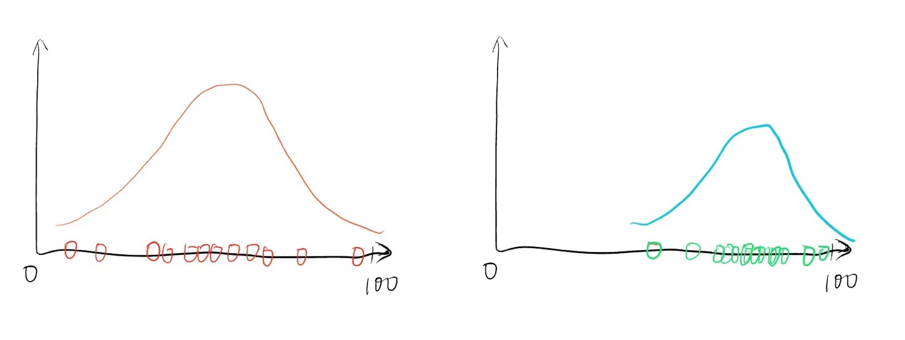
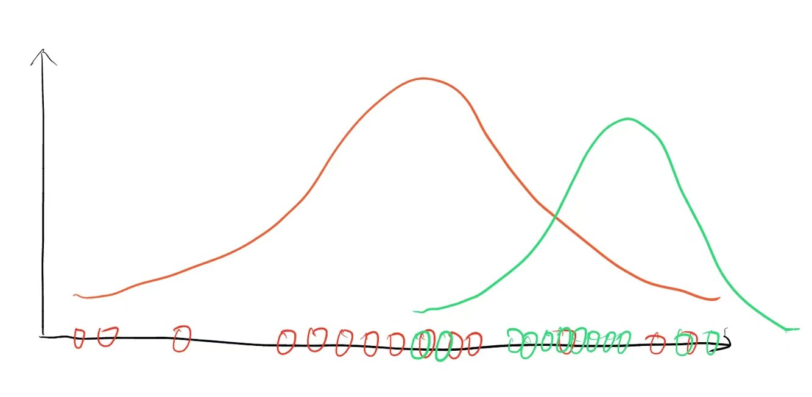
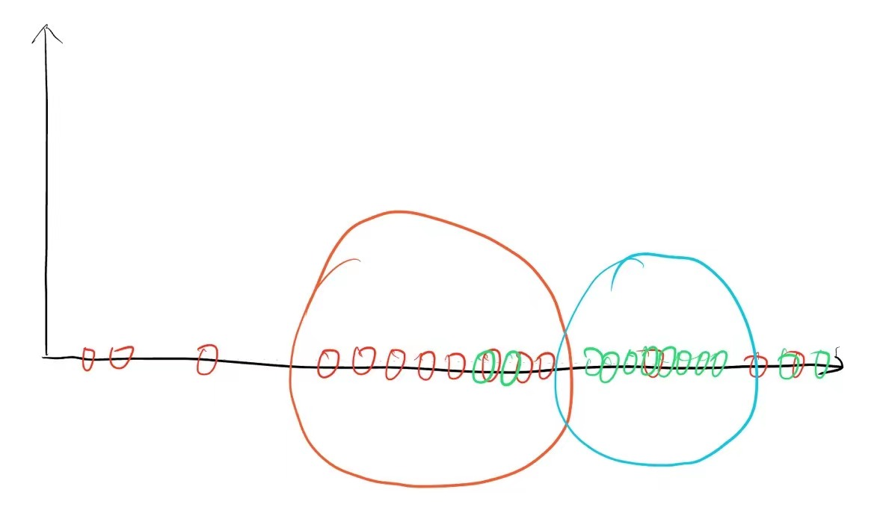
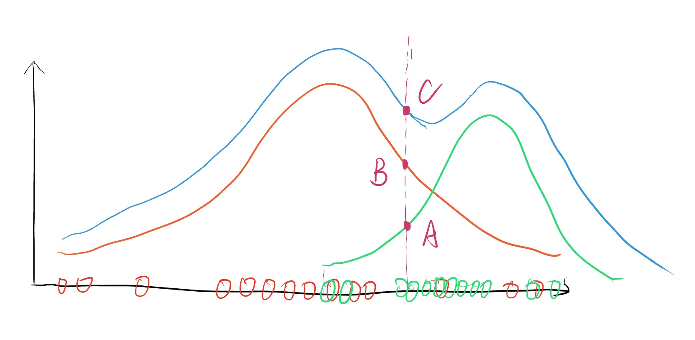

# 0 引言

+ 从一个班级内抽取多个学生的成绩，组成一个随机变量。通常分数极高或极低的人数都是少部分，而大多数同学的分数可能集中在某个区间内，因此可以认为考试成绩近似为高斯分布，其概率密度函数如下图所示：

+ 现在考虑更复杂的情况，从差班和火箭班各自抽取多个学生的成绩，分别构成两个随机变量，同样的，每个班各自的成绩分布都分别是高斯分布，如下图所示：

  

+ 上述例子是我们以上帝视角，能够从差班和火箭班抽取学生的成绩，并且能够计算出各自高斯分布的参数（均值，方差）。然而现实情况通常可能是：

  + 从一堆数据中，判断某个样本是差班的还是火箭班的。
  + 对上一个示例的更贴近认知的解释：从一堆数据中，判断某个样本的类别是行人还是汽车。

  如下图所示：

  

在不知道两个类别的数据分布（高斯分布）的参数的情况下，我们可以使用K-Means等聚类方法进行聚类，如下图所示：

然而，K-Means算法至少存在两个问题：

1. K-Means只能进行硬分类，即要么属于差班，要么属于火箭班。然而，成绩考100分的同学就一定不会是差班的吗？显然K-Means的分类结果过于绝对。
2. 无法获得某个样本属于某个类别的概率。即，对于一个成绩为100分的同学，可能其属于差班的概率是$10\%$，属于火箭班的概率是$90\%$。 

此外，与K-Means算法不同，高斯混合模型属于生成模型。即，K-Means只能拿着已有的数据进行聚类，而一旦我们知道高斯混合模型的参数之后，可以生成新的符合该概率分布的样本点。

# 1 混合模型

混合模型（hybrid model）是几种不同模型组合而成的一种模型（来自百度百科）。如，由多个符合高斯分布的模型组合起来的模型叫做高斯混合模型。

# 2 高斯混合模型

假设我们从某学校的差班和火箭班中分别采样多名同学的考试成绩如下图所示：

现在我们想用一个混合模型来描述上图所示的两个高斯分布，最直观的想法可能如下图所示（不是很准确，但确实很直观，也最容易想到）：

现在只看混合模型，对于任意一名同学的成绩 $x = s $ 分，有 $p_1$ 的概率属于差班，有 $p_2$ 的概率属于火箭班，显然有 $p_1 + p_2 = 1$。因此，混合模型中的任意一个样本属于哪个类别，也是一个随机变量，我们用 $Z$ 来表示。在该例子中，$Z$ 是一个离散型随机变量，要么是差班（$z_1$），要么是火箭班 （$z_2$）。离散型随机变量$Z$ 的概率分布如下所示：

| Z     | $z_1$ | $z_2$ |
| ----- | ----- | ----- |
| **P** | $p_1$ | $p_2$ |

对于离散型随机变量 $Z$ ，其参数为 $p_1$ 和 $p_2$ ，且 $\sum_{i=1}^{N} p_i = 1$ ，其中本例中 $N = 2$ 为类别总数。

因此，在高斯混合模型中，$x = s$ 的概率即可转化为一个全概率公式：
$$
P(X = s) = P(Z = z_1) P(X=s|Z=z_1) + P(Z = z_2) P(X=s|Z=z_2)
$$
考虑更一般的情况，假设有 $N$ 个类别，则 $z_i \in  \{1, 2, 3, ..., N\}$，高斯混合模型的概率密度函数可以表示为：
$$
P(X = x) = \sum_{i=1}^{N} P(Z = z_i) P(X=x|Z=z_i)
$$
其中，$\sum_{i=1}^{N} P(Z=z_i) = 1$。 $P(X=x|Z=z_i)$ 表示当选择了第 $z_i$ 个类别时，$X=x$ 的概率。显然，该概率可以利用第 $z_i$ 个类别的高斯分布的概率密度函数来计算，这里我们把该概率表示为：$P(X=x|Z=z_i) = N(X=x|\mu_i, \sigma_i)$ ，其中 $\mu_i$ 和 $\sigma_i$ 分别表示第 $z_i$ 个类别的高斯分布的期望和标准差。

至此，我们得到了高斯混合模型的模型表达式，再回过头来看，该模型中存在的参数包括：

+ 离散型随机变量 $Z$ 的参数 $p_1, p_2, ..., p_N$。
+ $N$ 个高斯分布的期望和方差：$\mu_1, \mu_2, ..., \mu_N$ 和 $\sigma_1, \sigma_2, ..., \sigma_N$

下面的任务就需要求解这些参数了。

**Optional : **

另外补充一点，从高斯混合模型的模型表达式可以发现，其实混合模型也就相当于对多个高斯分布进行加权平均，而加权平均的权重为 $Z$ 。

# 3 利用极大似然估计求解参数

# 4 利用EM算法求解参数

