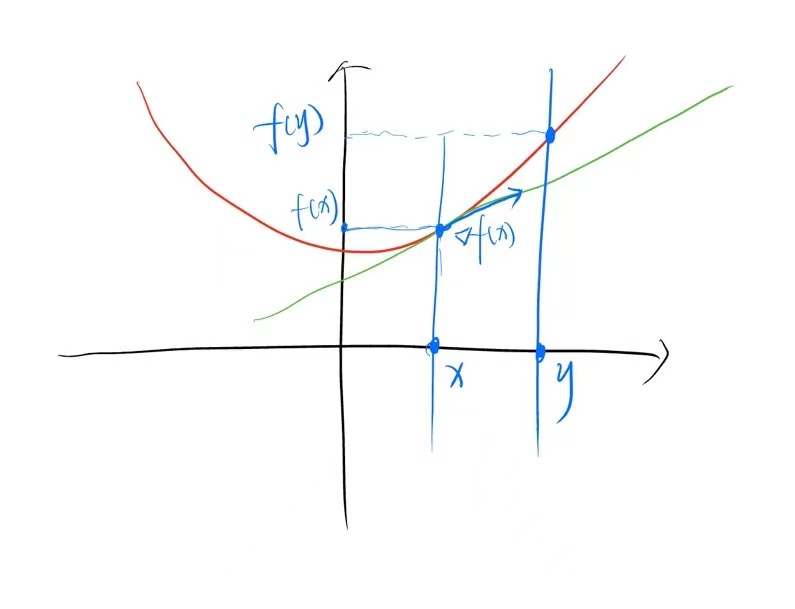
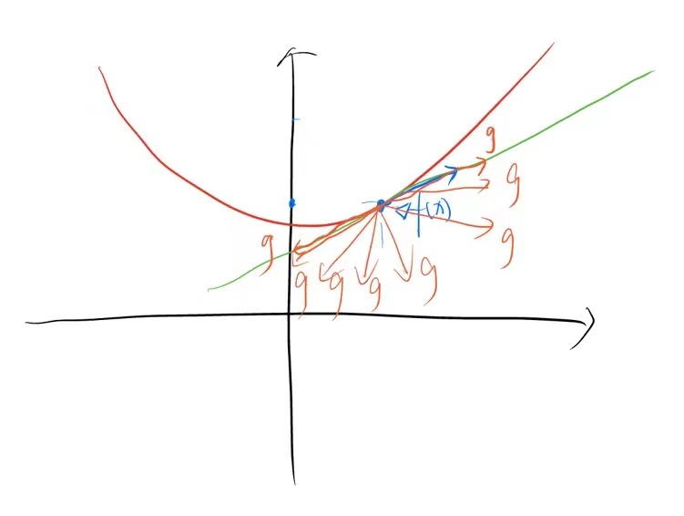
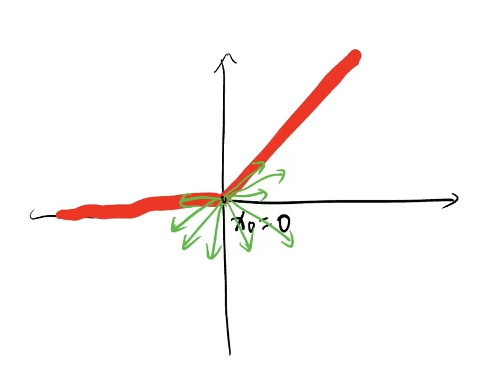
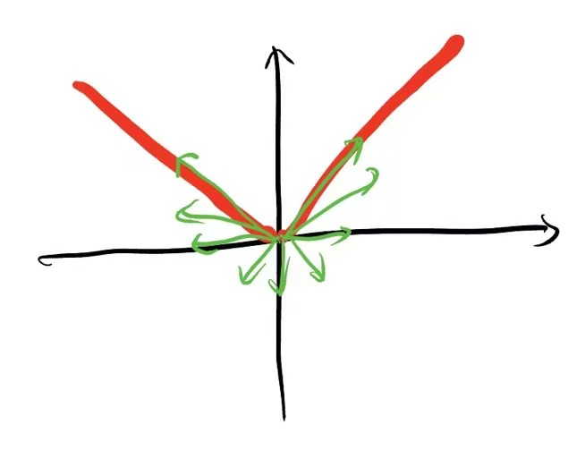
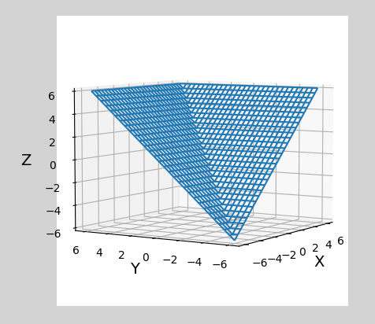
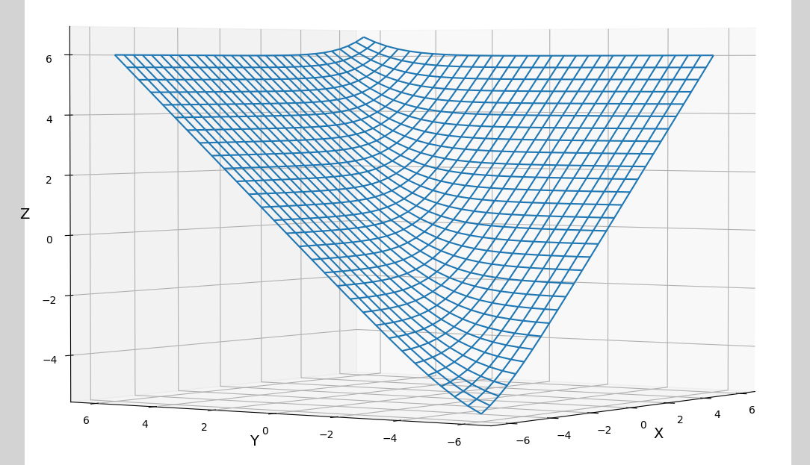
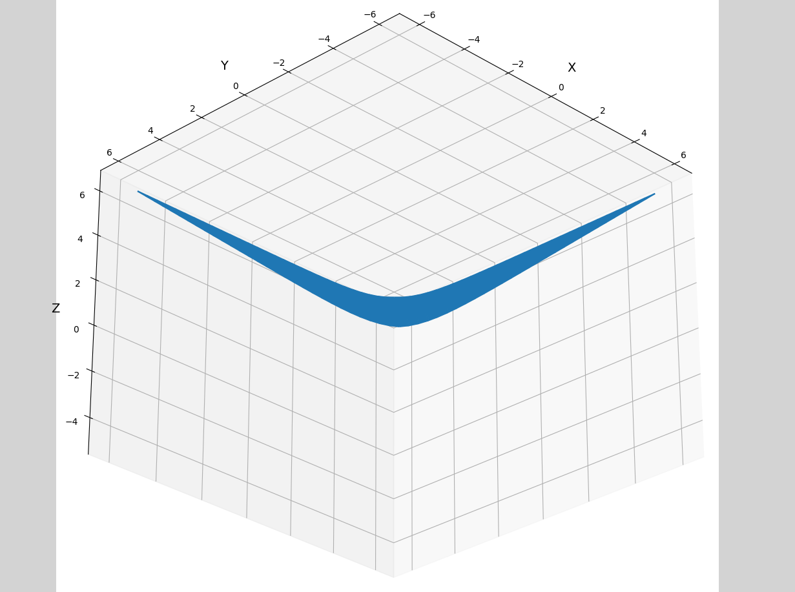
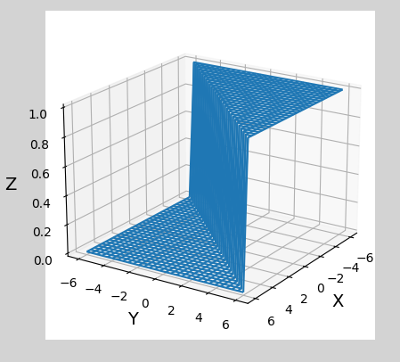

# 1 ReLU

ReLU在 $x=0$ 处不连续，因此也不可导。解决ReLU不可导的问题通常采用 **次梯度** 。

## 1.1 次梯度

为了简化问题，后续都假设目标函数 $f(x)$ 是凸函数。

在介绍 **次梯度** 之前，首先回顾凸函数 $f(x)$ 的梯度（$f(x)$ 是凸函数的充要条件）：
$$
f(y) \ge f(x) + \nabla f(x) (y - x)
$$


即，凸函数的切线总在函数下方，如下图所示。



在 **次梯度** 中，只需将梯度 $\nabla f(x)$ 替换为次梯度 $g$ 即可：
$$
f(y) \ge f(x) + g (y - x)
$$
相较于梯度而言，次梯度的方向并不一定沿着切线方向，而是只要满足上式成立都可以。类比于上图中的梯度，可以发现次梯度的方向只要不超过梯度方向即可，如下图所示：



显然，所有次梯度 $g$ 构成了一个集合，将这个集合记作 $f$ 在 $x$ 处的 **次微分** $\partial f(x)$ 。

## 1.2 ReLU的次梯度

ReLU在 $x_0 = 0$ 处不可导，因此可以使用次梯度来代替梯度。计算过程如下：

+ 计算出 ReLU ($f(x)$) 在 $x_0 = 0$ 处的左导数：
  $$
  a = \lim \limits_{x \to x_0^-} \frac{f(x) - f(x_0)}{x - x_0}
  $$
  
+ 计算出 ReLU ($f(x)$) 在 $x_0 = 0$ 处的右导数：
  $$
  b = \lim \limits_{x \to x_0^+} \frac{f(x) - f(x_0)}{x - x_0}
  $$
  

则 ReLU 的次微分等于闭区间 $[a, b]$ 占用的任一个取值，如下图所示：



然而，在实践中，我们通常只取 $a$ 或 $b$ 作为ReLU在 $x_0 = 0$ 处的次梯度，即 $0$ 或 $1$ 。并将次梯度作为ReLU的梯度用于BP。


# 2 L1 Loss

L1 Loss 和 ReLU类似，在 $x_0 = 0$ 处不可导，其函数图像如下图所示：



次梯度的方向如上图中绿线所示。实验发现，在 `pytorch` 中， $x_0 = 0$ 处的次梯度取值为 $0$ 。


# 3 max

$max(x, y)$ 的函数图像如下图所示：



可以发现当 $x = y$ 时， $max(x, y)$ 不可导（**需要特别注意，对于其他位置，max 操作是可导的**）。

## 3.1 max函数表达式

通常我们计算两个数的 max 操作，都会采用如下方式：

```python
def max1(x, y):
    return x if x > y else y
```

即：
$$
max(x, y) = 
\left \{
             \begin{array}{lr}
             x, & x>y \\
             y, & else\\

             \end{array}

\right.
$$
或者可以写成下式：
$$
max(x, y) = \frac{x+y + |x - y|}{2}
$$
无论上面两种 $max$ 表达式的哪一种，都可以计算出，当 $x \neq y$  时，导数为 1。

当有更多输入时，如计算 $max(x_1, x_2, x_3, ...)$ 可以递归的计算 $max(x1, max(x2, max(x3, max(...))))$ 。

那么，问题就是当 $x = y$ 时的导数的问题。后续几节将或对 $x=y$ 时的导数进行讨论，或对 $max$ 整体采用更加优雅的方式计算梯度。

## 3.2 次梯度

类比于 L1 Loss，我们可以定义 $x = y$ 时的次梯度（比如，定义次梯度为 $0$, 或 $1$ ，或 $-1$）

## 3.3 LogSumExp

LogSumExp的思想非常简单，对于 $max(x_1, x_2, x_3, ... x_n)$ ，假如 $x_3$ 最大，那么就想通过一个变换，使得 $x_1, x_2, x_4, ..., x_n$ 都趋近于0即可。之后，我们就可以使用Sum求和操作，另  $max(x_1, x_2, x_3, ... x_n) \approx 0+0+x_3+0+...+0 \approx x_3$ 。

**LogSumExp** 的计算过程如下 （以 $max(1, 2, 3, 4, 2)$ 为例）：

+ 首先最简单的思想是首先放大各个输入之间的差距，如指数函数映射：
  $$
  exp(1,2,3,4,2) = [ 2.7182817,  7.389056,  20.085537,  54.59815,    7.389056 ]
  $$

+ 之后求和：
  $$
  sum(exp(1,2,3,4,2)) = 92.18008
  $$

+ 最后使用 $ln$ 将指数空间映射回原始空间：
  $$
  ln(sum(exp(1,2,3,4,2))) = 4.523744
  $$

可以发现，最终的结果 $4.523744$ 约等于 $max(1,2,3,4,2) = 4$。

该过程可以表示为：
$$
max(x_1, x_2, ..., x_n) = ln(e^{x_1} + e^{x_2} +...+ e^{x_n}) = ln(\sum_{i=1}^{n} e^{x_i})
$$
此外，上述过程处处可导，避免了 max 操作中的不可导问题。

需要注意，使用上述方式计算出的 $4.523744$ 和 $max(1,2,3,4,2) = 4$ 仍然差距较大。而指数空间映射的过程就是放大差异的，因此可以在这个阶段进一步增大不同输入之间的差异，如各个输入都乘以一个缩放因此 $t = 10$ ，最后再对计算的结果除以 $t$ 即可：
$$
exp(10,20,30,40,20) = [ 2.7182817,  7.389056,  20.085537,  54.59815,    7.389056 ]
$$

$$
sum(exp(10, 20, 30, 40, 20)) = 2.3539596e+17
$$

$$
ln(sum(exp(10, 20, 30, 40, 20))) = 40.000046
$$

$$
40.000046 / 10 = 4.000004577636719
$$

该过程可以表示为：
$$
max(x_1, x_2, ..., x_n) = \frac{1}{t}ln(e^{tx_1} + e^{tx_2} +...+ e^{tx_n})  = \frac{1}{t}ln(\sum_{i=1}^{n} e^{tx_i})
$$
可以根据不同精度要求，通过调整 $t$ 的大小来控制精度。

LogSumExp的函数图像如下图所示：






## 3.4 LogSumExp的证明

+ 从结果上看，LogSumExp的输出约等于max的输出
+ 从函数图像上看，LogSumExp相当于是max的平滑近似

然而，使用LogSumExp来代替max有没有严格的数学证明呢？

证明如下：

对于 $max(X) = \frac{1}{t}ln(\sum_{i=1}^{n} e^{tx_i})$ ，若要使等号成立，则应该令 $t \to + \infty$。即：
$$
max(X) = \lim \limits_{t \to +\infty} \frac{1}{t}ln(\sum_{i=1}^{n} e^{tx_i})
$$
利用夹逼定理：
$$
\frac{1}{t}ln(\sum_{i=1}^{n} e^{tx_i}) \le \frac{1}{t}ln(\sum_{i=1}^{n} e^{tmax(X)}) = \frac{1}{t}ln(ne^{tmax(X)}) = \frac{ln(n)}{t}+max(X)
$$
当 $t -> +\infty$时，$\lim \limits_{t \to +\infty} \frac{ln(n)}{t} = 0$，即：
$$
logsumexp(X) = \lim \limits_{t \to +\infty} \frac{1}{t}ln(\sum_{i=1}^{n} e^{tx_i}) \le max(X)
$$

## 3.5 矩阵中的max计算

如通常在卷积神经网络中使用maxpooling，而logsumexp的计算涉及到 $ln$ 和 $exp$ 计算，计算量较大且结果并不一定精确。

那么，能否有一种即简单、又准确、又可导的方式来实现诸如maxpooling等max操作呢？

首先看如下矩阵：
$$
X = [1,2,3,4]^T
$$
这里我们将 $X$ 当作一维列矩阵。然后，使用窗口为 2， 步长为 2 的最大池化滤波器进行滤波，得到输出：
$$
Y = [2, 4]^T
$$
上述过程可以使用矩阵乘法来完成：$Y = wX$

其中，$w$ 是记录了最大元素所在位置的onehot向量：
$$
w = 
\begin{bmatrix}
0 & 1 & 0 & 0 \\
0 & 0 & 0 & 1 \\
\end{bmatrix}
$$
因此：
$$
Y = wX = [2, 4]^T
$$
我们也可以方便的根据矩阵导数计算出BP时的梯度：
$$
\frac{\partial Y}{\partial X} = w
$$
可以发现，$w$ 中有梯度的位置的梯度值都是1，这和之前max函数图像及表达式的计算结果一致。并且可以很方便的通过链式法则，使用乘法来传递梯度。


# 4 argmax

$argmax(x, y)$ 的函数图像如下图所示：



可以发现，argmax要么导数为0，要么导数不存在（$x = y$ 时），当导数不存在时可以使用次梯度，然而从图中也可以明显发现，次梯度仍然只能是0。因此，都是0的梯度在链式反传时也就没有意义了。

## 4.1 soft-argmax

以分类任务为例，分类任务中的argmax通常和softmax一起使用（不一起使用也不影响soft-argmax的计算），用来确定最大输出值的位置下标。原始的argmax计算方式如下：
$$
z = [1, 2, 3, 4, 2] \\
softmax(z) =  [0.02948882 & 0.08015893 & 0.21789455 & 0.5922988 &  0.08015893] \\
argmax(softmax(z)) = 3
$$
上述方式不可导，而soft-argmax的计算方式如下：

+ 假设有 $softmax(z) =  [0.02948882,  0.08015893,  0.21789455,  0.5922988,  0.08015893]$

+ 产生一个由位置索引组成的向量 $p = [0, 1, 2, 3, 4]$

+ 计算 $softmax(z)$ 和 $p$ 的点乘：
  $$
  softmax(x) p^T = 0.02948882 \times 0 + 0.08015893 \times 1 + 0.21789455 \times 2 + 0.5922988 \times 3 + 0.08015893 \times 4 \\
  = 2.61348015 \approx 3
  $$

然而，该方法和LogSumExp存在相同的问题，即结果较为不准确。同样，也可以在 $exp$ 中（这里是在 $softmax$ 中）使用 $tx_i$ 的方式来增大不同输入之间的差异：
$$
softmax(x_i) = \frac{e^{tx_i}}{\sum_{j=1}^{n} e^{tx_j}}
$$
上述过程可以表示为：
$$
softargmax(X) \approx \sum_{i=0}^{n} i \times softmax(x_i)
$$

## 4.2 计算图

实际coding中，也可以采用把不可导的操作（argmax）移出计算图的方式来解决argmax不可导的问题。当然，虽然移出计算图，但还是要保证我们确确实实用到了argmax的结果。伪代码如下所示：

```python
x = [0.02948882,  0.08015893,  0.21789455,  0.5922988,  0.08015893]
y_hard = one_hot(argmax(X)) # [0, 0, 0, 1, 0]
y = (y_hard - x).detach() + x # [0, 0, 0, 1, 0]
```

可以发现，我们后续使用的 $y$ 是 one_hot（相当于argmax），但是我们把不可导的argmax部分通过 `detach` 已经移出计算图了。即：

+ 前馈传播时：后续计算使用的是 one_hot
+ 反向传播时：计算梯度使用的是 $x = softmax(z) =  [0.02948882,  0.08015893,  0.21789455,  0.5922988,  0.08015893]$


