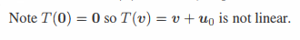
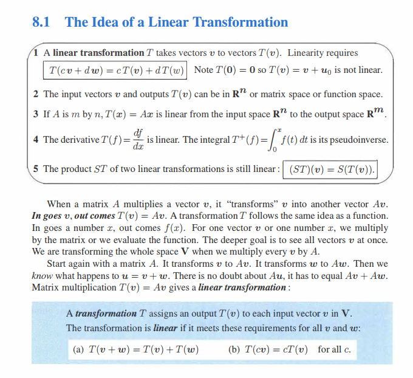

中英文对照：

+ 线性映射：Linear Mapping
+ 线性变换：Linear Transformation
+ 仿射变换：Affine Transformation

# 线性映射

**定义 ：**线性映射是从一个向量空间 $V$ 到向量空间 $W$ 的映射，且需要满足：

+ 可加性 ： $f(x + y) = f(x) + f(y)$
+ 齐次性： $f(ax) = af(x)$

则称 $f(\cdot)$ 是线性映射。

需要注意，向量空间 $V$ 和向量空间 $W$ 可以是同一个向量空间（如，都是二维），也可以是不同的向量空间（如，一个二维一个三维）。

举个例子：
$$
\begin{bmatrix}
a_{00} & a_{01}  \\
a_{10} & a_{11} \\
\end{bmatrix}

\begin{bmatrix}
x_1 \\
x_2 \\
\end{bmatrix}
$$
是在同一个空间内的线性映射（变换前后，$X$ 都是在二维空间）
$$
\begin{bmatrix}
a_{00} & a_{01}  \\
a_{10} & a_{11} \\
a_{20} & a_{21} \\
\end{bmatrix}

\begin{bmatrix}
x_1 \\
x_2 \\
\end{bmatrix}
$$
是从二维空间到三维空间的线性映射。

# 线性变换

线性变换是线性映射的一个特例，需要满足线性映射是在自身空间内进行的。即，线性映射前后，空间维度不变。

**在深度学习中，通常是不区分线性映射和线性变换的。**

需要特别注意，$XW + B$ 不是线性变换。因为不满足齐次性：
$$
f(X + Y) = (X+Y)W + B \ne (XW + B) + (YW + B)
$$
**因此，严格意义上说，卷积不是线性变换，而是仿射变换（线性变换+平移）。**

**从定义上讲，关于卷积不是线性变换的说法，不要有任何疑问，下图是 Gilbert Strang 老爷子的 `INTRODUCTION TO LINEAR ALGEBRA` 书中 `Capter 8 Linear Transformations` 的截图：**

# 仿射变换

仿射变换 = 线性变换 + 平移：
$$
T(x) = Ax + b
$$
